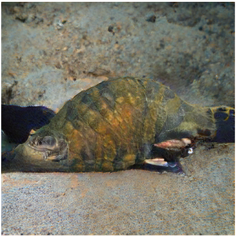
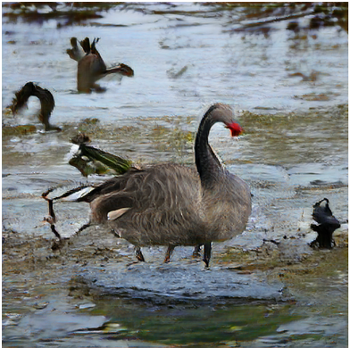
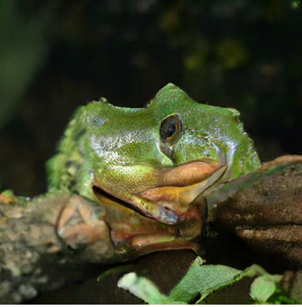
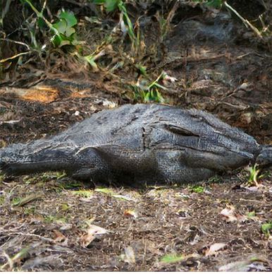
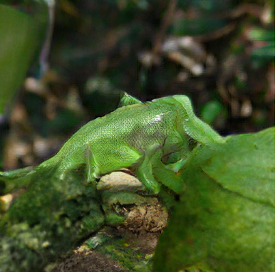
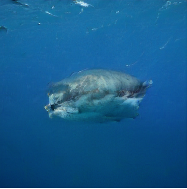

# Uncanny-valley-GAN
BigGan that can generate only  creepy uncanny valley looking pictures

## Inspired by:
1. BigGAN* - 
2. [Deep Dream](https://en.wikipedia.org/wiki/DeepDream)

* it's actually exactly the BigGan

## What it's about?

The idea is to ask BigGan to interpolate between two pictures from different categories and take this middle picture

Example 1 | Example 2 | Example 3
--- | --- | --- |
 |  | 

Example 4 | Example 5 | Example 6
--- | --- | --- |
 |  | 

## Try it out in the Google Colab:
https://colab.research.google.com/drive/1cfLXs8B9H4_cC-gpPF3BrHISulFw-DNK?usp=sharing